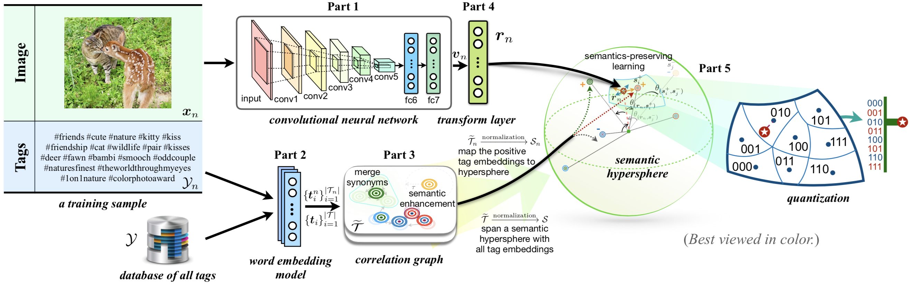

# WSDHQ: Weakly Supervised Deep Hyperspherical Quantization for Image Retrieval

[toc]

## 1. Introduction



This repository provides the code for our paper at **AAAI 2021**:

**Weakly Supervised Deep Hyperspherical Quantization for Image Retrieval**. Jinpeng Wang, Bin Chen, Qiang Zhang, Zaiqiao Meng, Shangsong Liang, Shu-Tao Xia. [[link](https://ojs.aaai.org/index.php/AAAI/article/view/16380)].

We proposed WSDHQ, a weakly supervised deep quantization approach for image retrieval. Instead of requiring ground-truth labels, WSDHQ leverages the informal tags provided by amateur users to guide quantization learning, which can alleviate the reliance on manual annotations and facilitate the feasibility of industrial deployment. 
In WSDHQ, we propose *a tag processing mechanism based on correlation* to enhance the weak semantics of such noisy tags. 
Besides, we learn quantized representations on the hypersphere manifold, on which we design a novel *adaptive cosine margin loss* for embedding learning and a *supervised cosine quantization loss* for quantization. 
Experiments on  Flickr-25K and NUS-WIDE datasets demonstrate the superiority of WSDHQ.

In the following, we will guide you how to use this repository step by step. 🤗

## 2. Preparation

```bash
git clone https://github.com/gimpong/AAAI21-WSDHQ.git
cd AAAI21-WSDHQ/
tar -xvzf data.tar.gz
rm -f data.tar.gz
```

### 2.1 Requirements

- python 3.7.8
- numpy 1.19.1
- scikit-learn 0.23.1
- h5py 2.10.0
- python-opencv 3.4.2
- tqdm 4.51.0
- tensorflow 1.15.0


### 2.2 Download image datasets and pre-trained models. Organize them properly

Before running the code, we need to make sure that everything needed is ready. First, the working directory is expected to be organized as below:

<details><summary>AAAI21-WSDHQ/</summary>
<ul>
    <li>data/</li>
    <ul>
    	<li>flickr25k/</li>
    	<ul>
        <li>tags</li>
        <ul>
          <li>FinalTagEmbs.txt</li>
          <li>TagIdMergeMap.pkl</li>
        </ul>
    		<li>common_tags.txt</li>
    		<li>database_img.txt</li>
    		<li>database_label.txt</li>
    		<li>train_img.txt</li>
    		<li>train_tag.txt</li>
    		<li>test_img.txt</li>
    		<li>test_label.txt</li>
    	</ul>
    	<li>nus-wide/</li>
    	<ul>
        <li>tags</li>
        <ul>
          <li>FinalTagEmbs.txt</li>
          <li>TagIdMergeMap.pkl</li>
        </ul>
    		<li>TagList1k.txt</li>
    		<li>database_img.txt</li>
    		<li>database_label.txt</li>
    		<li>train_img.txt</li>
    		<li>train_tag.txt</li>
    		<li>test_img.txt</li>
    		<li>test_label.txt</li>
    	</ul>
    </ul>
    <li>datasets/</li>
    <ul>
      <li>GoogleNews-vectors-negative300.bin.gz</li>
    	<li>flickr25k/</li>
    	<ul>
    		<li>mirflickr/</li>
    		<ul>
    			<li>im1.jpg</li>
    			<li>im2.jpg</li>
    			<li>...</li>
    		</ul>
    	</ul>
    	<li>nus-wide/</li>
    	<ul>
    		<li>Flickr/</li>
    		<ul>
    			<li>actor/</li>
    			<ul>
    				<li>0001_2124494179.jpg</li>
    				<li>0002_174174086.jpg</li>
    				<li>...</li>
    			</ul>
    			<li>administrative_assistant/</li>
    			<ul>
    				<li>...</li>
    			</ul>
    			<li>...</li>
    		</ul>
    	</ul>
    </ul>
    <li>scripts/</li>
    <ul>
    	<li>run0001.sh</li>
    	<li>run0002.sh</li>
    	<li>...</li>
      <li>tag_processing.sh</li>
    </ul>
    <li>train.py</li>
    <li>validation.py</li>
    <li>net.py</li>
    <li>net_val.py</li>
    <li>util.py</li>
    <li>dataset.py</li>
    <li>alexnet.npy</li>
</ul>
</details>

#### Notes

- The `data/` folder is the collection of data splits for Flickr25K and NUS-WIDE datasets. The **raw images** of Flickr25K and NUS-WIDE datasets should be downloaded additionally and arranged in `datasets/flickr25k/` and `datasets/nus-wide/` respectively. Here we provide copies of these image datasets, you can download them via [Google Drive](https://drive.google.com/drive/folders/1lKMr3rFAmsDDWJKW5DU_WXiv7at04vPb?usp=sharing) or [Baidu Wangpan (Web Drive, password: **ocmv**)](https://pan.baidu.com/s/1tno2iBm_D3mZ661Bha8Vfw).

- The pre-trained files of AlexNet (`alexnet.npy`) and Word2Vec (`GoogleNews-vectors-negative300.bin.gz`) can be downloaded from [Baidu Wangpan (Web Drive, password: **ocmv**)](https://pan.baidu.com/s/1twwfC5J5EtGH-ZVfpJXmcQ).

## 3. Enhance the weak semantic information of tags via preprocessing (Optional)
We have provided enhanced tag embeddings in this repository. See `data/flickr25k/tags/` and `data/nus-wide/tags/`. 
If you want to reproduce these files, you can remove them and execute
```python
cd scripts/
# '0' is the id of GPU
bash tag_processing.sh 0
```

## 4. Train and then evaluate

To facilitate reproducibility, we provide the scripts with configurations for each experiment. The scripts can be found under the scripts/ folder. 
For example, if you want to train and evaluate an 8-bit WSDHQ model on Flickr25K dataset, you can do

```bash
cd scripts/
# '0' is the id of GPU
bash run0001.sh 0
```

The script `run0001.sh` includes the running commands:

```bash
#!/bin/bash

cd ..

##8 bits
#                     dataset  lr      iter  lambda    subspace_num  loss   notes  gpu
python train.py       flickr   0.0003  800   0.0001    1             WSDQH  0001   $1
#                     dataset  model_weight                                                                 gpu
python validation.py  flickr   ./checkpoints/flickr_WSDQH_nbits=8_adaMargin_gamma=1_lambda=0.0001_0001.npy  $1

cd -
```

After running a script, a series of files will be saved under `logs/` and `checkpoints/`. Take `run0001.sh` as an example: 

<details><summary>AAAI21-WSDHQ/</summary>
<ul>
    <li>logs/</li>
    <ul>
    	<li>flickr_WSDQH_nbits=8_adaMargin_gamma=1_lambda=0.0001_0001.log</li>
    </ul>
    <li>checkpoints/</li>
    <ul>
    	<li>flickr_WSDQH_nbits=8_adaMargin_gamma=1_lambda=0.0001_0001.npy</li>
    	<li>flickr_WSDQH_nbits=8_adaMargin_gamma=1_lambda=0.0001_0001_retrieval.h5</li>
    </ul>
    <li>...</li>
</ul>
</details>


Here we report the results of running the scripts on a GTX 1080 Ti. Results are shown in the following table. We have also uploaded the logs and checkpoint information for reference, which can be downloaded from [Baidu Wangpan (Web Drive, password: **ocmv**)](https://pan.baidu.com/s/1twwfC5J5EtGH-ZVfpJXmcQ).

Note that some values can slightly deviate from the reported results in our original paper. The phenomenon is caused by the randomness of Tensorflow and the software and hardware discrepancies.

<table>
<thead>
  <tr>
    <th>Script</th>
    <th>Dataset</th>
    <th>Code Length / bits</th>
    <th>MAP</th>
    <th>Log</th>
  </tr>
</thead>
<tbody>
  <tr>
    <td><a href="scripts/run0001.sh">run0001.sh</a></td>
    <td rowspan="4">Flickr25K</td>
    <td>8</td>
    <td>0.766</td>
    <td><a href="reference_logs/flickr_WSDQH_nbits=8_adaMargin_gamma=1_lambda=0.0001_0001.log">flickr_WSDQH_nbits=8_adaMargin_gamma=1_lambda=0.0001_0001.log</a></td>
  </tr>
  <tr>
    <td><a href="scripts/run0002.sh">run0002.sh</a></td>
    <td>16</td>
    <td>0.755</td>
    <td><a href="reference_logs/flickr_WSDQH_nbits=16_adaMargin_gamma=1_lambda=0.0001_0002.log">flickr_WSDQH_nbits=16_adaMargin_gamma=1_lambda=0.0001_0002.log</a></td>
  </tr>
  <tr>
    <td><a href="scripts/run0003.sh">run0003.sh</a></td>
    <td>24</td>
    <td>0.765</td>
    <td><a href="reference_logs/flickr_WSDQH_nbits=24_adaMargin_gamma=1_lambda=0.0001_0003.log">flickr_WSDQH_nbits=24_adaMargin_gamma=1_lambda=0.0001_0003.log</a></td>
  </tr>
  <tr>
    <td><a href="scripts/run0004.sh">run0004.sh</a></td>
    <td>32</td>
    <td>0.767</td>
    <td><a href="reference_logs/flickr_WSDQH_nbits=32_adaMargin_gamma=1_lambda=0.0001_0004.log">flickr_WSDQH_nbits=32_adaMargin_gamma=1_lambda=0.0001_0004.log</a></td>
  </tr>
  <tr>
    <td><a href="scripts/run0005.sh">run0005.sh</a></td>
    <td rowspan="4">NUS-WIDE</td>
    <td>8</td>
    <td>0.717</td>
    <td><a href="reference_logs/nuswide_WSDQH_nbits=8_adaMargin_gamma=1_lambda=0.0001_0005.log">nuswide_WSDQH_nbits=8_adaMargin_gamma=1_lambda=0.0001_0005.log</a></td>
  </tr>
  <tr>
    <td><a href="scripts/run0006.sh">run0006.sh</a></td>
    <td>16</td>
    <td>0.727</td>
    <td><a href="reference_logs/nuswide_WSDQH_nbits=16_adaMargin_gamma=1_lambda=0.0001_0006.log">nuswide_WSDQH_nbits=16_adaMargin_gamma=1_lambda=0.0001_0006.log</a></td>
  </tr>
  <tr>
    <td><a href="scripts/run0007.sh">run0007.sh</a></td>
    <td>24</td>
    <td>0.730</td>
    <td><a href="reference_logs/nuswide_WSDQH_nbits=24_adaMargin_gamma=1_lambda=0.0001_0007.log">nuswide_WSDQH_nbits=24_adaMargin_gamma=1_lambda=0.0001_0007.log</a></td>
  </tr>
  <tr>
    <td><a href="scripts/run0008.sh">run0008.sh</a></td>
    <td>32</td>
    <td>0.729</td>
    <td><a href="reference_logs/nuswide_WSDQH_nbits=32_adaMargin_gamma=1_lambda=0.0001_0008.log">nuswide_WSDQH_nbits=32_adaMargin_gamma=1_lambda=0.0001_0008.log</a></td>
  </tr>
</tbody>
</table>

## 5. References

If you find this code useful or use the toolkit in your work, please consider citing:

```
@inproceedings{wang2021wsdhq,
  title={Weakly Supervised Deep Hyperspherical Quantization for Image Retrieval},
  author={Wang, Jinpeng and Chen, Bin and Zhang, Qiang and Meng, Zaiqiao and Liang, Shangsong and Xia, Shutao},
  booktitle={Proceedings of the AAAI Conference on Artificial Intelligence},
  volume={35},
  number={4},
  pages={2755--2763},
  year={2021}
}
```

## 6. Acknowledgements

We use [DeepHash](https://github.com/thulab/DeepHash) as the code base in our implementation. 

## 7. Contact
If you have any question, you can raise an issue or email Jinpeng Wang ([wjp20@mails.tsinghua.edu.cn](wjp20@mails.tsinghua.edu.cn)). We will reply you soon.